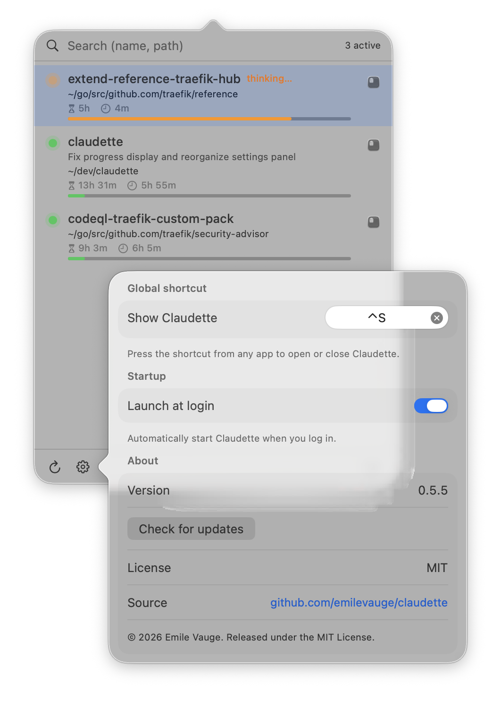

# Claudette

A macOS menu bar app that lists every running Claude Code session and lets you jump to its Ghostty terminal (or the Claude Desktop app) in one click.

<p align="center">
  
</p>

## Download

Grab the latest signed `.app` from the [releases page](https://github.com/emilevauge/claudette/releases/latest).

Double-click `Claudette.dmg` and drag the app onto the `Applications` shortcut. Or from the command line :

```sh
curl -L -o Claudette.dmg \
  https://github.com/emilevauge/claudette/releases/latest/download/Claudette.dmg
hdiutil attach Claudette.dmg
cp -R "/Volumes/Claudette/Claudette.app" /Applications/
hdiutil detach "/Volumes/Claudette"
xattr -dr com.apple.quarantine /Applications/Claudette.app   # ad-hoc signed, bypass Gatekeeper
open /Applications/Claudette.app
```

## Features

- **Live session list** : every running Claude Code session, refreshed every 2 s, dead PIDs culled automatically.
- **Three,state activity dot** : orange pulses while Claude thinks, red pulses when it's blocked waiting on you (permission prompt or `AskUserQuestion`), steady green when idle.
- **Rich rows** : LLM,generated `ai-title`, working directory, total duration, time since last activity, and a colored context,window fill bar (green → red) reading the live `used_percentage` from your status,line sidecar.
- **One,click focus** : matches the session by `ai-title` and jumps to the exact Ghostty window, tab and split. Background agents launched from Claude Desktop are listed too and activate Claude.app on click.
- **Instant search** : start typing as soon as the popover opens, multi,token filter on name, title and path. `↑↓` navigate, `↵` focus, `esc` close.
- **Native notifications** : when Claude flips from thinking to waiting, with a preview of the last message; click to focus the terminal.
- **One,click auto,update** : the update notification carries an `Update` action that downloads the DMG, swaps the bundle and relaunches Claudette.
- **Global shortcut + launch at login** : configurable shortcut (default `⌃Space`), optional auto,start via a user `LaunchAgent`.
- **Localised** : English, French, Spanish, auto,selected from the OS locale.

<p align="center">
  
</p>

## Requirements

- macOS 14 (Sonoma) or later, tested on macOS 26 (Sequoia).
- [Ghostty](https://ghostty.org/) for the click-to-focus integration.
- Swift 5.9+ (Xcode Command Line Tools).

## Build

```sh
git clone https://github.com/emilevauge/claudette.git
cd claudette

# Dev binary (fast iteration, no bundle ID so notifs use the AppleScript fallback)
swift build
.build/debug/Claudette

# Proper .app bundle (recommended : enables native UNUserNotificationCenter)
./make-app.sh

# Or install to /Applications
./make-app.sh --install
open /Applications/Claudette.app
```

The `make-app.sh` script:

1. Builds `release`.
2. Renders the SwiftUI app icon (terminal glyph on sand/brown gradient) at 1024×1024 via `Claudette --generate-icon`, then `sips` for all required sizes, then `iconutil` to produce `AppIcon.icns`.
3. Assembles `Claudette.app/Contents/{MacOS,Resources,Info.plist}` with `CFBundleIdentifier`, `LSUIElement=true`, `NSAppleEventsUsageDescription`, and `CFBundleIconFile`.
4. Ad-hoc signs the bundle.
5. Registers it with LaunchServices so notifications work.

## Permissions

On first launch Claudette will ask for:

- **Automation → Ghostty** : required to enumerate terminals and focus the right window. Triggered automatically on the first AppleScript call.
- **Notifications** : tap *Allow* on the system prompt for banner notifications when a session goes from thinking to waiting.

If you accidentally refuse one of them, reset and relaunch:

```sh
tccutil reset AppleEvents dev.claudette.app
tccutil reset Notifications dev.claudette.app
open /Applications/Claudette.app
```

## How it works

```
~/.claude/sessions/<pid>.json   ──┐
~/.claude/projects/<slug>/        │
       <sessionId>.jsonl          ├─►  SessionStore (2 s polling)
       (last ai-title entry,      │      │
        tail,read + mtime cache)  │      │
Ghostty AppleScript dictionary  ──┘      │
        (working directory + name        │
         of terminals)                   │
                                         ▼
                              ClaudeSession  (PID alive, aiTitle, isBusy from Ghostty title)
                                            │
                            ┌───────────────┴───────────────┐
                            ▼                               ▼
                  MenuView (SwiftUI list,            SystemNotifications
                  search, click → focus)             (UNUserNotificationCenter
                            │                         + AppleScript fallback)
                            ▼
                  GhosttyBridge.focus(session)
                  └─► focus terminal <id>  (window + tab + split,
                       matched by ai-title, fallback to cwd)
```

Key files :

- `Sources/Claudette/SessionStore.swift` : polling + Ghostty annotation.
- `Sources/Claudette/GhosttyBridge.swift` : AppleScript ↔ Ghostty.
- `Sources/Claudette/ClaudeDesktopBridge.swift` : activates the Claude Desktop app for sessions without a terminal.
- `Sources/Claudette/UpdateChecker.swift` : queries the GitHub releases API at launch, fires the "Update available" notification.
- `Sources/Claudette/SelfUpdater.swift` : downloads the new DMG, stages a detached zsh helper that swaps the bundle and relaunches.
- `Sources/Claudette/MenuView.swift` : popover UI.
- `Sources/Claudette/AppDelegate.swift` : `NSStatusItem` + `NSPopover` + global shortcut.
- `Sources/Claudette/SystemNotifications.swift` : native notifications.
- `Sources/Claudette/ConversationReader.swift` : last assistant text and last `ai-title` from `~/.claude/projects/<slug>/<sessionId>.jsonl` (tail,read, cached by mtime).
- `Sources/Claudette/LaunchAgent.swift` : login item.
- `make-app.sh` : `.app` packaging.

## License

MIT (see `LICENSE`).
