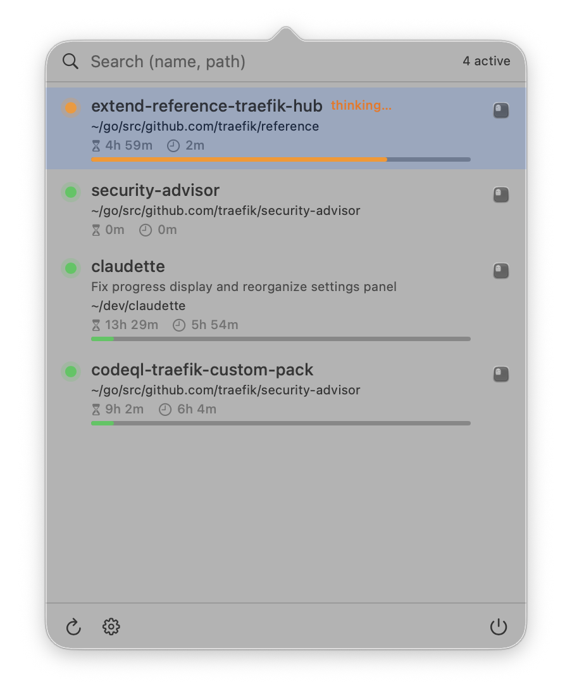

# Claudette

A macOS menu bar app that lists every running Claude Code session and lets you jump to its Ghostty terminal (or the Claude Desktop app) in one click.

<p align="center">
  
</p>

## Download

Grab the latest signed `.app` from the [releases page](https://github.com/emilevauge/claudette/releases/latest).

Double-click `Claudette.dmg` and drag the app onto the `Applications` shortcut. Or from the command line :

```sh
curl -L -o Claudette.dmg \
  https://github.com/emilevauge/claudette/releases/latest/download/Claudette.dmg
hdiutil attach Claudette.dmg
cp -R "/Volumes/Claudette/Claudette.app" /Applications/
hdiutil detach "/Volumes/Claudette"
xattr -dr com.apple.quarantine /Applications/Claudette.app   # ad-hoc signed, bypass Gatekeeper
open /Applications/Claudette.app
```

## Features

- **Live session list** : reads `~/.claude/sessions/*.json` every 2 s and keeps only sessions whose PID is still alive (`kill(pid, 0)`).
- **Three,state activity dot** : orange pulsing while Claude is computing (Braille spinner in the Ghostty title), red pulsing when Claude is blocked waiting for you (a permission prompt or an `AskUserQuestion`, detected via `assistant stop_reason: tool_use` with no matching `user / tool_result` in the JSONL), green pulsing when the turn is fully wrapped up. All three pulse, so any live session feels alive in the menu bar.
- **LLM,generated subtitle** : each row shows the `ai-title` Claude Code writes into the JSONL transcript, the same string it injects into the Ghostty tab title. Updates live as the conversation progresses.
- **Per-session metrics** : working directory, total session duration, time since last activity.
- **Context window fill bar** : thin colored bar at the bottom of each row (green → yellow → orange → red) showing the live `context_window.used_percentage` Claude Code reports. Requires the user's status line in `~/.claude/settings.json` to expose the JSON to `/tmp/claudette/<sessionId>.json` (Claudette's installer can add the two,line `tee` shim to your existing `statusline-command.sh`); the bar simply hides itself when the sidecar is missing.
- **Instant search** : start typing as soon as the popover opens, multi-token filter on name, ai,title, path and basename. `↑↓` to navigate, `↵` to focus, `esc` to clear/close.
- **One-click focus** : matches the right Ghostty terminal by `ai-title` (deterministic, even with multiple tabs in the same cwd) with a `working directory` + Braille/`✳` heuristic fallback, then issues the Ghostty `focus terminal <id>` AppleScript so the right window, tab and split come to the front.
- **Claude Desktop sessions** : background agents launched from the Claude Desktop app (`entrypoint = claude-desktop` in the session JSON) are listed too, with a distinct icon. Clicking activates the Claude app since these sessions have no terminal of their own.
- **One-click auto,update** : when a newer release is available, the notification carries an `Update` action that downloads the DMG, swaps the bundle in place via a detached helper script, and relaunches Claudette. The `Release notes` action opens the GitHub page if you want to read what changed first.
- **Native notifications** : when a session transitions from thinking to waiting, macOS shows a notification with title, path and preview of the last assistant message. Click it to focus the corresponding Ghostty window.
- **Global keyboard shortcut** : configurable via a `KeyboardShortcuts` recorder in the settings pane. Default `⌃Space`.
- **Launch at login** : optional, implemented via a user `LaunchAgent` so it works on a raw SPM binary (no `.app` bundle required for that feature).
- **Localised** : English, French, Spanish, auto-selected from the OS locale.

## Requirements

- macOS 14 (Sonoma) or later, tested on macOS 26 (Sequoia).
- [Ghostty](https://ghostty.org/) for the click-to-focus integration.
- Swift 5.9+ (Xcode Command Line Tools).

## Build

```sh
git clone https://github.com/emilevauge/claudette.git
cd claudette

# Dev binary (fast iteration, no bundle ID so notifs use the AppleScript fallback)
swift build
.build/debug/Claudette

# Proper .app bundle (recommended : enables native UNUserNotificationCenter)
./make-app.sh

# Or install to /Applications
./make-app.sh --install
open /Applications/Claudette.app
```

The `make-app.sh` script:

1. Builds `release`.
2. Renders the SwiftUI app icon (terminal glyph on sand/brown gradient) at 1024×1024 via `Claudette --generate-icon`, then `sips` for all required sizes, then `iconutil` to produce `AppIcon.icns`.
3. Assembles `Claudette.app/Contents/{MacOS,Resources,Info.plist}` with `CFBundleIdentifier`, `LSUIElement=true`, `NSAppleEventsUsageDescription`, and `CFBundleIconFile`.
4. Ad-hoc signs the bundle.
5. Registers it with LaunchServices so notifications work.

## Permissions

On first launch Claudette will ask for:

- **Automation → Ghostty** : required to enumerate terminals and focus the right window. Triggered automatically on the first AppleScript call.
- **Notifications** : tap *Allow* on the system prompt for banner notifications when a session goes from thinking to waiting.

If you accidentally refuse one of them, reset and relaunch:

```sh
tccutil reset AppleEvents dev.claudette.app
tccutil reset Notifications dev.claudette.app
open /Applications/Claudette.app
```

## How it works

```
~/.claude/sessions/<pid>.json   ──┐
~/.claude/projects/<slug>/        │
       <sessionId>.jsonl          ├─►  SessionStore (2 s polling)
       (last ai-title entry,      │      │
        tail,read + mtime cache)  │      │
Ghostty AppleScript dictionary  ──┘      │
        (working directory + name        │
         of terminals)                   │
                                         ▼
                              ClaudeSession  (PID alive, aiTitle, isBusy from Ghostty title)
                                            │
                            ┌───────────────┴───────────────┐
                            ▼                               ▼
                  MenuView (SwiftUI list,            SystemNotifications
                  search, click → focus)             (UNUserNotificationCenter
                            │                         + AppleScript fallback)
                            ▼
                  GhosttyBridge.focus(session)
                  └─► focus terminal <id>  (window + tab + split,
                       matched by ai-title, fallback to cwd)
```

Key files :

- `Sources/Claudette/SessionStore.swift` : polling + Ghostty annotation.
- `Sources/Claudette/GhosttyBridge.swift` : AppleScript ↔ Ghostty.
- `Sources/Claudette/ClaudeDesktopBridge.swift` : activates the Claude Desktop app for sessions without a terminal.
- `Sources/Claudette/UpdateChecker.swift` : queries the GitHub releases API at launch, fires the "Update available" notification.
- `Sources/Claudette/SelfUpdater.swift` : downloads the new DMG, stages a detached zsh helper that swaps the bundle and relaunches.
- `Sources/Claudette/MenuView.swift` : popover UI.
- `Sources/Claudette/AppDelegate.swift` : `NSStatusItem` + `NSPopover` + global shortcut.
- `Sources/Claudette/SystemNotifications.swift` : native notifications.
- `Sources/Claudette/ConversationReader.swift` : last assistant text and last `ai-title` from `~/.claude/projects/<slug>/<sessionId>.jsonl` (tail,read, cached by mtime).
- `Sources/Claudette/LaunchAgent.swift` : login item.
- `make-app.sh` : `.app` packaging.

## License

MIT (see `LICENSE`).
